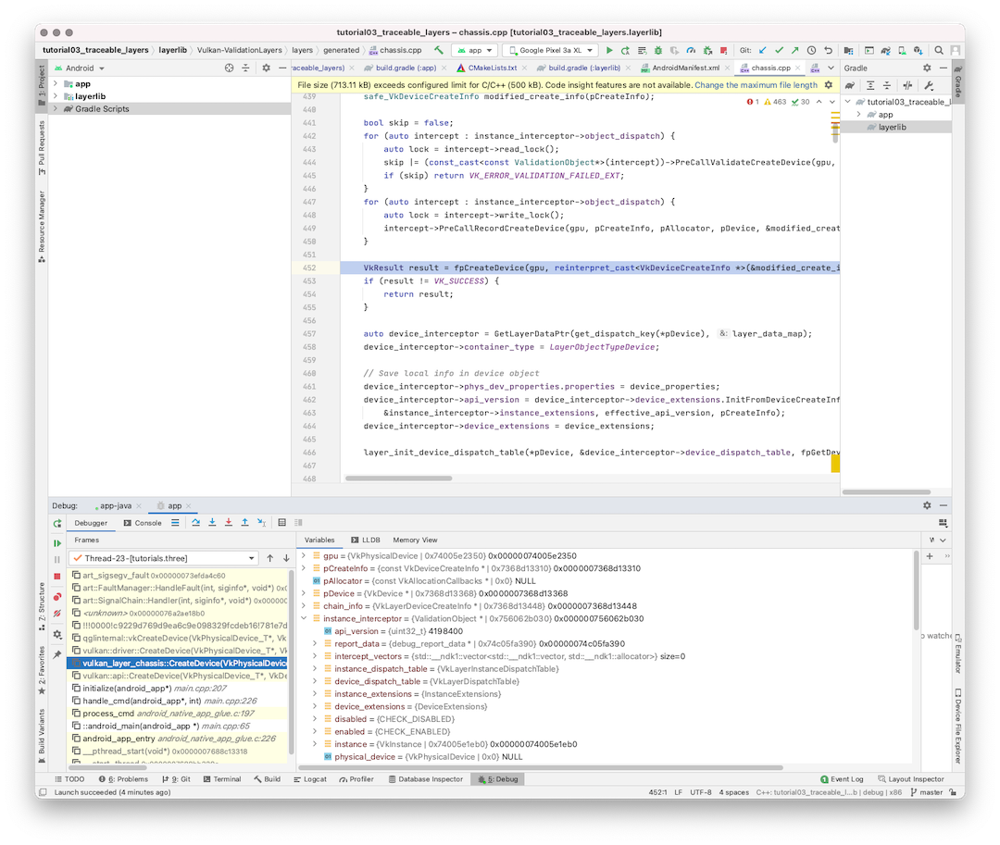

# Tutorial 03 - traceable_layers
This has the same functionality as [Tutorial 2](../tutorial02_prebuild_layers), but building the validation layers
from the Khronos Group Validation Layer source code hosted on [the github repo](https://github.com/KhronosGroup/Vulkan-ValidationLayers.git).
The benefit is:
- you could trace into validation layers.
- you could observe the detailed status when validation layer finds issues in your app.

Validation layers are stable now, this should be a good help to developers who likge to know
more about validation layers inside.

# Background
Layer source status:
- For NDK version <= r21, there are multiple layers for Android; NDK keeps a snapshot of layer source code and the binaries
- For NDK22 layers are consolidated into one layer: VkLayer_khronos_validation; NDK keeps a snapshot of layer source code and the binary
- For NDK version >= r23, layer source and binary are not available anymore.

We recommend developers to get the validation layer source and binary releases directly from
[the github repo](https://github.com/KhronosGroup/Vulkan-ValidationLayers.git).

# Build Instructions
In this sample, the validation layers is wrapped into a gradle library module called "layerlib", it is a dependent module to application
code(to force it build before app).The validation layer source code needs to be pulled in ahead of time before building the sample:
1. cd tutorial03_traceable_layers/layerlib
2. git clone --recursive https://github.com/KhronosGroup/Vulkan-ValidationLayers.git
3. cd Vulkan-ValidationLayers/build-android
4. ./update_external_sources_android.sh --no-build
    (use the update_external_sources_android.bat for Windows OS)
5. Now, at this point, open this sample with Android Studio with "Open an Existing Project" option
6. Build the project, and start debugging(Run > Debug App). It takes about 20 minutes to build layers, so be patient

Once app triggers validation layer assert(embedded on purpose inside this sample in the app), you could see the stack frames
inside Studio IDE., inside the debug window, you would see all validation layer variables when the app error is validated.

This sample is not tested on windows, it should work.

## future work
- Automically pull the source code automatically in gradle, but gradle's 'ndkBuild path' is evaluated before source code pulling,
hence errors out, need help to get it done.
- automatically run update_external_sources_android.sh. probably needs a gradle task to do it.

# Screenshot

